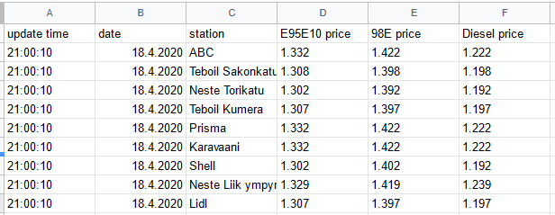

# Gasoline price forecast

Application is used to get gasoline price data from Polttoaine.net, which is a service/website that provides gasoline price data. Price data is based on pricing data entered by users, so there might be some reliability issues related to data source, but in big picture/long run it seems to be good enough source for data.

## Overview of files

upload_price.py:
- Acts as a "master", that starts:
  - scrape_price.py (Price scraping)
    - Gets price from polttoaine.net (), and saves it to data.json

  - upload_gsheet.py (Google sheet updating)
    - Gets the price data from data.json, and saves it to google sheet

So if you don't want to use Google Spreadsheet for data storage, the upload_gsheet.py can be replaced with some alternative script.

    

## Setup
- For spreadsheet authentication, client_secret.json is needed
- Change your sheet name in upload_gsheet.py
- Change value of PAGE_URL in scrape_price.py to the polttoaine.net page (=city) you want to get the price data
